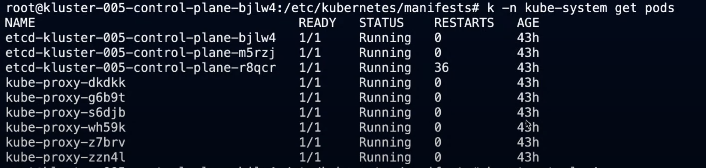

# Kluster 005
## User story
A cloud janitor studying CKS working with a traditional auditor in securing a kubernets cluster gets a user call saying her application service discovery stopped working and can prove this is global across the cluster by testing againtst kubernetes.default.svc from any pod.

```
Hi David,

Thank you for giving me and the auditor a chance to audit kluster5, auditors said:

"Things are not always as they seem, The first appearances decieves many"

Also,  a user passed by and reported  pods can not access the API server,
she was  testing with curl from inside a pod to verify by using the following command:

"curl -k https://kubernetes.default.svc/api"

Best,

Walid

```
## Discovered Symptoms
- kubectl get nodes returns nothing at first

  Fixer team impatience wait at least 20-30 seconds for any network timeout connectivity

  2nd time kubectl get node returns an error regarding etcd error
    
    
    there were several failure and success events, failure to connect to peer, and failure related to diskspace
    

- Could not browser to wordpress site, nor hubble, service discovery seems broken
  one possible cause suggested at the begining was coredns, but what was the root cause?
  
  
  
- Could not see control-plane pods even though `kubectl get pods -n kube-system returns some oher pods`
-

## Contributing Factors

- as this was a POC/test cluster, it seems that the janitor was deploying, deleting, and scaling several deployments while he set the etcd quota too short 400Mbyte which caused etcd stop writing to its database. Janitor is clueless, he remove the configuration thinking it should be fine, but it wasn't, it made things worst to team fix as ceph and cluster have many events by the time, fix team used the cluster it was wrecked.

maybe inspired by similar issues in Kubernetes Github [Etcd size sometimes starts growing and grows until "mvcc: database space exceeded" #45037](https://github.com/kubernetes/kubernetes/issues/45037)

- Auditor being traditional stopped network traffic forwarding, not knowing that container runtime create virtual interfaces for each container, or kubernetes creating virtual interfaces for its pods, this could attribute back to service traffic was blocked, context and cloud-native mindset could have helped. this was achived by using sysctl, in first episode iptables was used mistakenly by a security engineer, so this was a continution on that line of thought.

```bash

$ ansible -i inventory all -u root -m command -a 'sysctl -w net.ipv6.conf.all.forwarding=1'
$ ansible -i inventory all -u root -m command -a 'sysctl -w net.ipv4.ip_forward=1'

```

- Janitor studing for CKS started a network policy, however did not finish it causing all ingress traffic to be blocked.

```yaml
apiVersion: networking.k8s.io/v1
kind: NetworkPolicy
metadata:
  name: deny-wip
spec:
  podSelector: {}
  policyTypes:
  - Egress
  egress:
  
```


- Janitor used PodSecurityPolicy thinking to stop priviliged containers from running, raising the security bar, however, this will hide static pods if there were recreated, and will block special pods that required priviliged access such as CNI daemonsets and coredns if restarted from Running
of course  this needs to be added to the kube-api manifests, as well a global wide cluster-role and cluster-role-binding was used.

```yaml
apiVersion: policy/v1beta1
kind: PodSecurityPolicy
metadata:
  name: no-priviliged-pods
spec:
  privileged: false  # Don't allow privileged pods!
  # The rest fills in some required fields.
  seLinux:
    rule: RunAsAny
  supplementalGroups:
    rule: RunAsAny
  runAsUser:
    rule: RunAsAny
  fsGroup:
    rule: RunAsAny
  volumes:
  - '*'
```

## Notes from Kluster Breaker
- First for all appologies to Daniel Finneran and David. etcd size issue by itself was more than enough, did not imagine it would cause that much havoc, it is based on realistic use case we faced in 1.13 K8s POC cluster with large pods deployments and updates across 6 months (350+ pods, and atl least 1-2 disrupts/updates/evicitions monthly if not many due to user interactions)

- Second, even though this was the second episode, [crictl is an important tool for containerd "runtime" troubleshooting](https://kubernetes.io/docs/tasks/debug-application-cluster/crictl/), it would have saved time figuring out the master node status and the invisibility issue of the control-plane pods
  
  the configuration file just needs where the container runtime socket lives
  ```bash
 
 # cat /etc/crictl.yaml
 runtime-endpoint: unix:///var/run/containerd/containerd.sock
 
  ```
  
  

